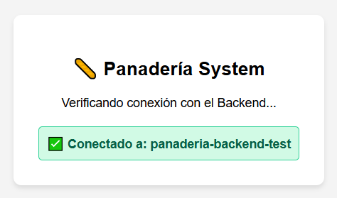
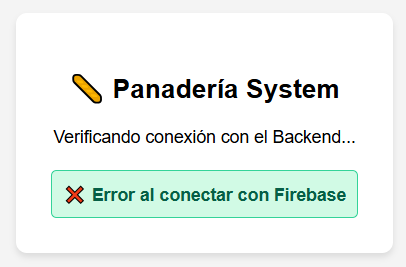

# Ejercicio 2: Setup del Proyecto y Conexión Web

## Descripción
Este directorio contiene la implementación inicial del proyecto **"Panadería Rural"**. El objetivo principal es establecer y validar la conexión con los servicios de Firebase utilizando el SDK Web Modular (v9+).

Se ha implementado una **Single Page Application (SPA)** ligera que actúa como panel de estado para verificar la disponibilidad del servicio.

## Detalles de Implementación

### 1. Configuración Modular

Se ha separado la lógica de configuración en `firebase-config.js` para mantener el principio de responsabilidad única. Se utiliza la sintaxis `import/export` nativa del navegador.

### 2. Validación de Conexión

El archivo `index.html` importa la instancia de `app` inicializada. Se ha implementado un script de validación que:

1. Intenta obtener la instancia del objeto `FirebaseApp`.
2. Verifica el `projectId` activo.
3. Actualiza el DOM en tiempo real mostrando un indicador visual (Semáforo Verde/Rojo) según el estado de la conexión.

## Resultados de la Actividad

A continuación se muestran las pruebas de ejecución del entorno local:

| Conexión Exitosa ✅ | Error de Conexión ❌ |
| --- | --- |
|  |  |
| *El SDK inicializa y detecta el Project ID* | *Simulación de fallo en credenciales* |

## Instrucciones de Ejecución

1. Abrir Visual Studio code
2. Ejecutar un servidor local (Live Server).
3. Navegar a `localhost:[puerto]/index.html`.

