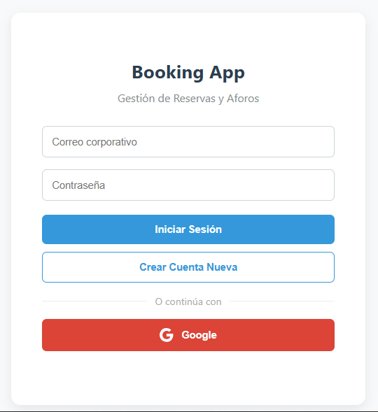
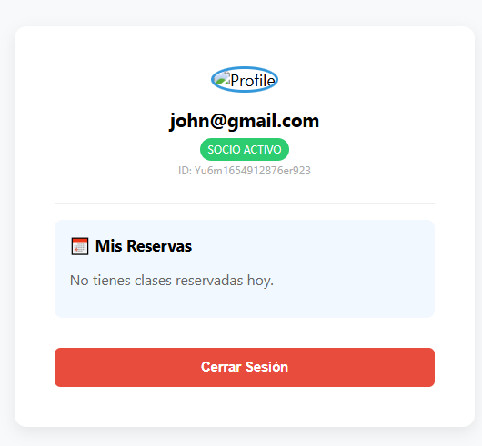

# Actividad 3: Módulo de Autenticación (Booking App)

## 📋 Descripción
Implementación de un sistema de control de acceso seguro para la plataforma de reservas "Booking App". Este módulo gestiona el ciclo de vida completo de la identidad del usuario, permitiendo el registro y acceso mediante credenciales tradicionales y proveedores federados (OAuth).

El objetivo es simular un "Portal del Socio" donde la interfaz reacciona en tiempo real al estado de la sesión.

## 📸 ScreenShoots

A continuación se muestran las capturas de la interfaz en sus dos estados principales:

| Vista de Acceso (Guest) | Vista de Socio (Logged In) |
|:---:|:---:|
|  |  |
| *Formulario de entrada con opción de Google* | *Dashboard con datos del usuario (UID/Email)* |

## 🔒 Nota de Seguridad (Facturación)
se han aplicado **restricciones HTTP** a las credenciales (API Keys).

* **Entornos permitidos:** `localhost`, `127.0.0.1`.
* **Comportamiento:** La aplicación funcionará perfectamente en entorno local. Si se desea desplegar en un entorno de staging/producción (ej. Firebase Hosting), será necesario añadir el dominio a la lista blanca en Google Cloud Console.

## 🛠 Stack Tecnológico
* **Firebase Authentication:** Gestión de identidades.
* **Providers:**
    * Email/Password.
    * Google Sign-In (Pop-up flow).
* **DOM Manipulation:** Interfaz reactiva sin frameworks (Vanilla JS).

## 🚀 Funcionalidades Implementadas

### 1. Gestión de Sesión
* **Registro de Usuarios:** Creación de cuentas nuevas con validación automática.
* **Login Social:** Integración con Google Identity Platform.
* **Persistencia:** Uso del observador `onAuthStateChanged` para mantener la sesión activa entre recargas de página (persistencia en IndexedDB gestionada por el SDK).

### 2. UI/UX Reactiva
* **Manejo de Errores:** Feedback visual al usuario ante credenciales incorrectas, contraseñas débiles o correos duplicados.
* **Renderizado Condicional:** La vista alterna automáticamente entre el formulario de Login y el Dashboard del Socio según el estado de la autenticación.


## 🔧 Cómo ejecutar este módulo

1. Asegúrate de tener el archivo `firebase-config.js` en la raíz de este directorio con las credenciales válidas.
2. Ejecuta un servidor local para evitar bloqueos por CORS (es necesario para los ES Modules).
   ```bash
   npx serve .
   # O usando Live Server en VS Code