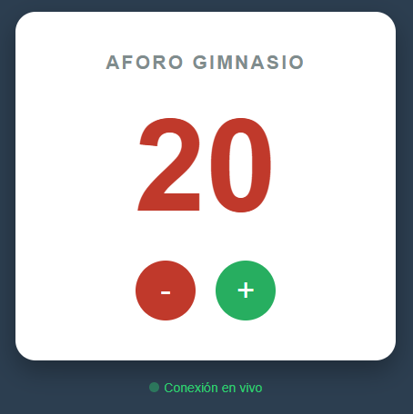

# Ejercicio 4: Contador de Aforo en Tiempo Real

## 📋 Descripción
Módulo de gestión de aforo para la **Booking App**. Utiliza **Firebase Realtime Database** para sincronizar el estado de ocupación del gimnasio instantáneamente entre todos los dispositivos conectados.

El sistema permite visualizar y modificar el número de asistentes, propagando los cambios en milisegundos gracias a la tecnología de WebSockets de Firebase.

### 📸 Capturas de Pantalla
A continuación se muestra el funcionamiento del contador en diferentes estados:

| Aforo Normal (Verde) | Aforo Alto (Rojo) |
|:---:|:---:|
|  |  |
| *Visualización estándar* | *Indicador visual de límite alcanzado* |

| Realtime Sync | Realtime Sync |
|:---:|:---:|
|  |  |
| *Vista de un PC* | *Vista de un movil* |

## 🛠 Stack Tecnológico
* **Firebase Realtime Database:** Base de datos NoSQL alojada en la nube (JSON Tree).
* **SDK Modular v9:** Uso de funciones `ref`, `onValue`, `get` y `set`.
* **Frontend:** Vanilla JS + CSS3 con animaciones de estado.

## 🚀 Funcionalidades
* **Sincronización en Vivo:** Uso del listener `onValue` para reflejar cambios remotos en tiempo real.
* **Persistencia:** Los datos se guardan en la nube y se mantienen al cerrar el navegador.
* **Indicador de Estado:** Feedback visual que alerta cuando el aforo supera las 20 personas.

## 🔧 Cómo probarlo
1. Clona el repositorio y ve al directorio `04-base-datos-realtime`.
2. Asegúrate de tener `firebase-config.js` con una `databaseURL` válida.
3. Ejecuta el servidor local:
   ```bash
   npx serve .