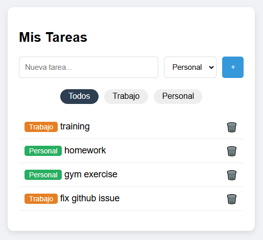
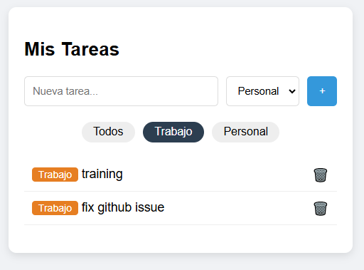
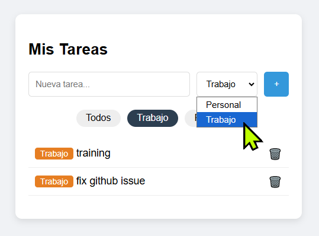

# Ejercicio 5: Gestor de Tareas con Filtros (Firestore)

## 📋 Descripción
Aplicación de gestión de tareas ("Todo App") que permite crear, borrar y **filtrar** tareas por categoría (Trabajo/Personal) en tiempo real.

Este proyecto introduce **Cloud Firestore**, una base de datos NoSQL orientada a documentos, ideal para consultas complejas y escalabilidad.

## 📸 Capturas de Pantalla (Filtrado en acción)
El sistema permite filtrar las tareas en el servidor antes de mostrarlas al usuario:

| 1. Vista "Todos" | 2. Filtro "Trabajo" | 3. Filtro "Personal" |
|:---:|:---:|:---:|
|  |  |  |
| *Muestra todas las tareas ordenadas por fecha.* | *Consulta filtrada solo por categoría 'Personal'.* | *Consulta filtrada solo por categoría 'Trabajo'.* |

## 🛠 Stack Tecnológico
* **Cloud Firestore:** Base de datos principal.
* **Firestore Queries:** Uso de `query`, `where` y `orderBy` para filtrado eficiente en servidor.
* **Índices Compuestos:** Optimización requerida por Google para consultas multicampo.
* **Vanilla JS:** Lógica de interfaz y manejo de estado asíncrono.


## 🚀 Funcionalidades
* **Filtrado Server-Side:** Los filtros se aplican en la base de datos, no en el cliente (ahorro de ancho de banda).
* **Ordenación Cronológica:** Las tareas aparecen siempre ordenadas por fecha de creación descendente.
* **Categorización Visual:** Etiquetas de color distintivas para cada tipo de tarea.
* **Realtime:** Los cambios se reflejan instantáneamente gracias al listener `onSnapshot`.

## ⚙️ Configuración Crítica (Setup)

Para que este proyecto funcione, se requirieron dos pasos manuales en la consola de Firebase:

### 1. Reglas de Seguridad (Modo Desarrollo)
Para evitar el error `permission-denied`, se abrieron los permisos temporalmente:
```javascript
rules_version = '2';
service cloud.firestore {
  match /databases/{database}/documents {
    match /{document=**} {
      allow read, write: if true;
    }
  }
}