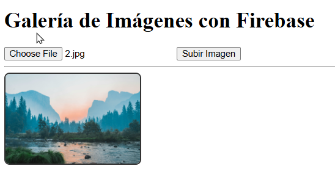
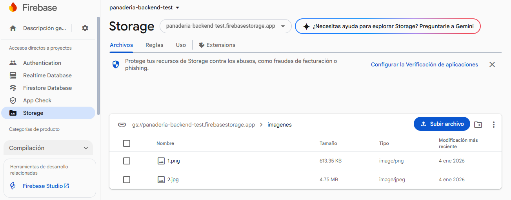

# Actividad 6: Galería de Imágenes con Firebase Storage

Este proyecto implementa una galería de imágenes sencilla que permite a los usuarios subir archivos locales a un bucket de Firebase Storage y visualizarlos inmediatamente en la página web.

## 📸 ScreenShoots

A continuación se muestran las capturas de la interfaz en sus dos estados principales:

| Vista web | FireStorage Console |
|:---:|:---:|
|  |  |
| *Formulario de entrada* | *firebase console* |

## 📋 Descripción

El objetivo de esta actividad es interactuar con el servicio de almacenamiento en la nube de Firebase utilizando el SDK modular (v9+). La aplicación realiza las siguientes funciones:
1.  Selección de archivos de imagen desde el dispositivo local.
2.  Subida del archivo (Blob/File) al bucket de Storage.
3.  Obtención de la URL pública de descarga (`downloadURL`).
4.  Renderizado dinámico de la imagen en el DOM.

## 🚀 Tecnologías

* HTML5 / CSS3
* JavaScript (ES Modules)
* Firebase SDK v10 (Storage)

## ⚙️ Configuración e Instalación

### 1. Requisitos previos
Para ejecutar este proyecto, necesitas un proyecto activo en [Firebase Console](https://console.firebase.google.com/) con el servicio **Storage** habilitado.

### 2. Configuración de Firebase
1.  Clona este repositorio o descarga los archivos.
2.  Abre el archivo `main.js`.
3.  Busca la constante `firebaseConfig` y reemplaza los valores con las credenciales de tu proyecto.
4.  **Importante:** Asegúrate de definir correctamente el `storageBucket`.

```javascript
// main.js
const firebaseConfig = {
    apiKey: "TU_API_KEY",
    authDomain: "TU_PROYECTO.firebaseapp.com",
    projectId: "TU_PROYECTO",
    storageBucket: "panaderia-backend-test.firebasestorage.app", // Tu bucket aquí
    messagingSenderId: "...",
    appId: "..."
};

### Photo
Photo by <a href="https://unsplash.com/@baileyzindel?utm_source=unsplash&utm_medium=referral&utm_content=creditCopyText">Bailey Zindel</a> on <a href="https://unsplash.com/photos/body-of-water-surrounded-by-trees-NRQV-hBF10M?utm_source=unsplash&utm_medium=referral&utm_content=creditCopyText">Unsplash</a>
      